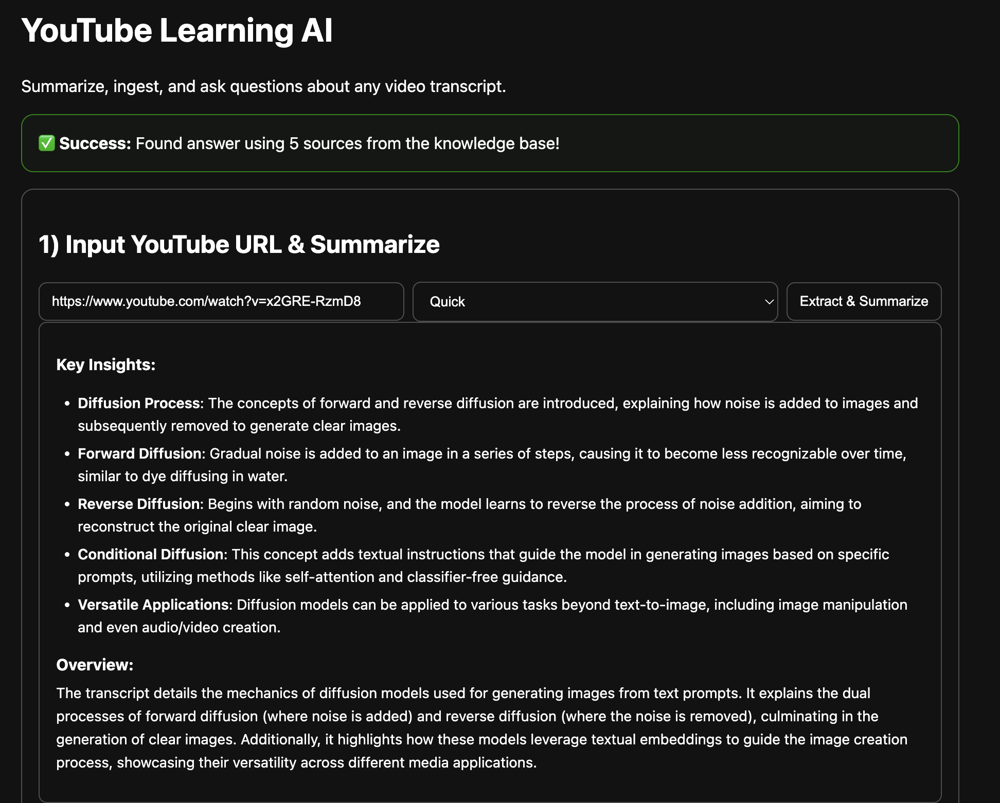
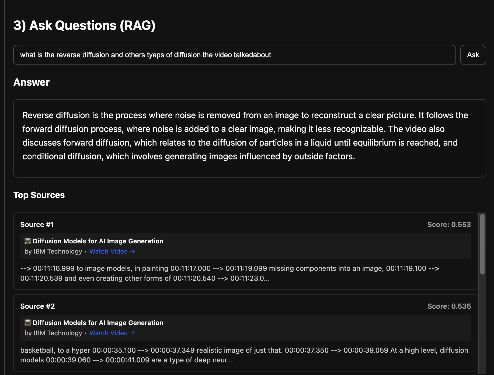

# YouTube Learning AI - Smart Video Content Assistant

**Transform any YouTube video into an interactive learning experience with AI-powered summarization and intelligent Q&A.**

## Demo link
https://youtube-extracter.vercel.app/

## What This App Does

This application solves a common problem: **How do you quickly extract and retain knowledge from long YouTube videos?** Instead of watching hours of content or taking manual notes, users can:

1. **Extract Content**: Paste any YouTube URL and automatically get the video's transcript

2. **Smart Summarization**: Get AI-generated summaries in two levels - quick overview or detailed analysis
3. **Build Knowledge Base**: Store video content in a searchable database for future reference
4. **Interactive Q&A**: Ask specific questions about any video and get accurate answers wimageith source citations

## Key Features & Business Value

- **Time Savings**: Get key insights from 2-hour videos in minutes
- **Better Retention**: Interactive Q&A helps reinforce learning
- **Personal Knowledge Base**: Build a searchable library of video content
- **Source Verification**: Every answer includes citations back to the original video

##  How It Works (Simple Explanation)

1. **Content Extraction**: The app connects to YouTube to automatically download video subtitles
2. **AI Summarization**: Uses advanced language models to create concise summaries
3. **Smart Storage**: Converts text into mathematical representations (embeddings) for fast searching
4. **Intelligent Search**: When you ask a question, it finds the most relevant parts of the video content
5. **Contextual Answers**: AI generates answers using only the relevant video content, ensuring accuracy

##  Technical Architecture

**Frontend**: React with TypeScript - Modern, responsive user interface
**Backend**: Python FastAPI - Fast, reliable API server
**AI Engine**: OpenAI GPT models for summarization and Q&A
**Database**: FAISS vector database for semantic search
**Deployment**: Ready for cloud deployment (Vercel, Render, etc.)

##  API Endpoints

- **Health Check**: `GET /health` - Verify the service is running
- **Extract Subtitles**: `POST /subtitles/extract` - Get video transcript and metadata
- **Generate Summary**: `POST /summarize` - Create AI-powered summaries
- **Store Content**: `POST /rag/ingest` - Add video content to knowledge base
- **Ask Questions**: `POST /rag/ask` - Get answers with source citations

##  Use Cases

- **Students**: Quickly understand lecture videos and prepare for exams
- **Professionals**: Extract insights from training videos and tutorials
- **Researchers**: Build searchable databases of educational content
- **Content Creators**: Analyze competitor videos and extract key points

##  Technical Highlights

- **Efficient Processing**: Duplicate detection prevents unnecessary AI API calls
- **Scalable Design**: Vector database supports thousands of video chunks
- **Error Handling**: Comprehensive error messages and fallback mechanisms
- **Modern Stack**: Built with industry-standard tools and best practices
- **Cost Optimization**: Smart chunking and duplicate detection minimize API costs
- **Token Management**: Built-in usage limits (10k daily, 1k hourly) with real-time tracking

## Future Enhancements

- Multi-video knowledge bases
- Flashcard generation for spaced repetition
- Learning analytics and progress tracking
- Collaborative knowledge sharing
- Mobile app development

---

*This project demonstrates end-to-end AI application development, from data extraction to intelligent user interfaces, showcasing skills in modern web development, AI integration, and user experience design.*
# YouTube-agent
# YouTube-agent
